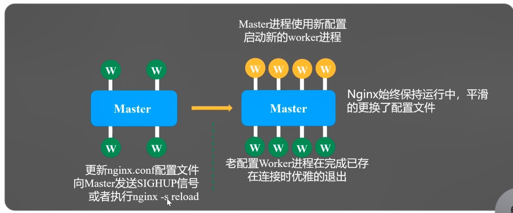
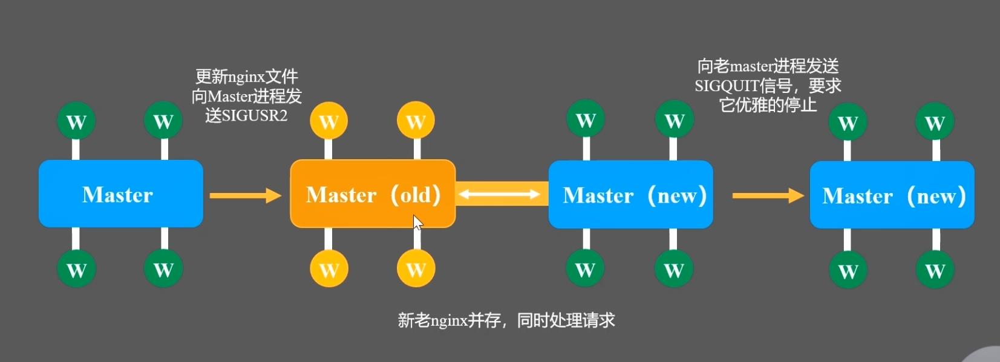

# reload流程
1. 向master进程发送HUP信号
2. master进程校验配置语法是否正确
3. master进程打开新的监听端口
4. master进程用新配置启动新的worker子进程
5. master进程向老worker子进程发送QUIT信号
6. 老worker进程关闭监听句柄，处理完当前连接后结束进程

# 热升级流程
1. 将旧Nginx文件换成新Nginx文件（注意备份）
2. 向master进程发送USR2
3. master进程修改pid文件名，加后缀.oldbin
4. master进程用新Nginx文件启动新master进程
5. 向老master进程发送QUIT信号，关闭老master进程
6. 回滚：向老master发送HUP，向新master发送QUIT

