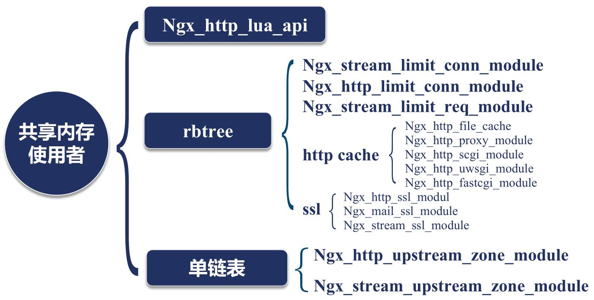
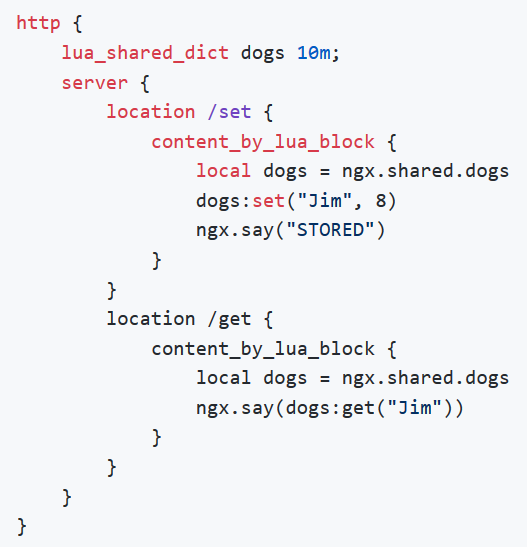

## nginx进程间的通讯方式
基础同步工具：
* 信号
* 共享内存

通讯方式：
* 锁（主要是自旋锁）
* Slab内存管理器

使用了共享内存的模块：


openResty使用共享内存示例：

lua_shared_dict使用LRU算法。是红黑树+单链表结构。单链表用来做内存淘汰。

## 内存管理工具：Slab管理器
共享内存被划分为多个页（页的大小固定，比如4K）。每个页上又划分出不同大小的slot。slot大小以2的次方大小。

ngx_slab_stat:可以监控slab状态，是tengine的模块。

将ngx_slab_stat编译进openresty：./configure --add-module=模块目录

查看slab_stat:
```nginx
location = /slab_stat {
    slab_stat;
}
```