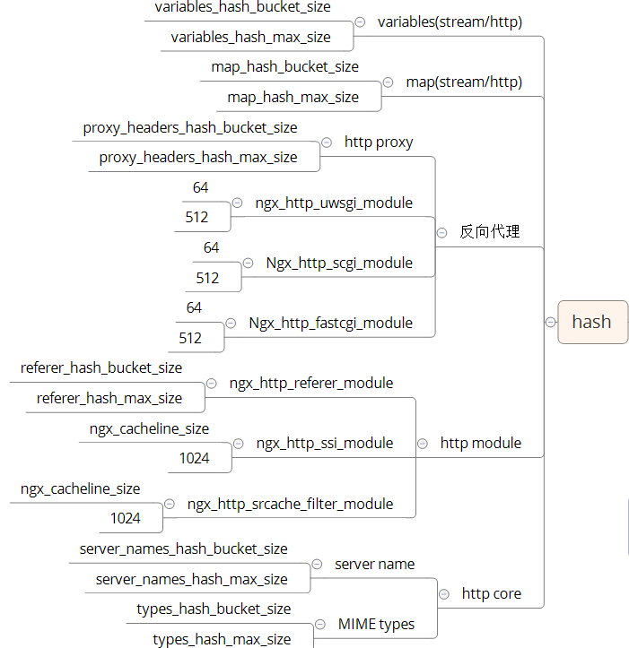

## nginx容器
* 数组
* 链表
* 队列
* 哈希表
* 红黑树
* 基数树

###哈希表

用来存储静态不变的元素，不会插入删除。
```
typedef struct {
    void             *value;
    u_short           len;
    u_char            name[1];
} ngx_hash_elt_t;


typedef struct {
    ngx_hash_elt_t  **buckets;
    ngx_uint_t        size;
} ngx_hash_t;
```
max size：限制hash表最大长度
bucket size：hash表实际的长度