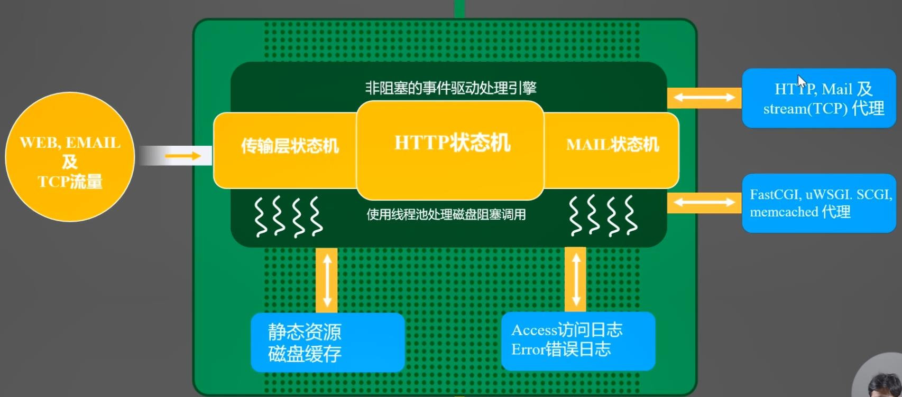
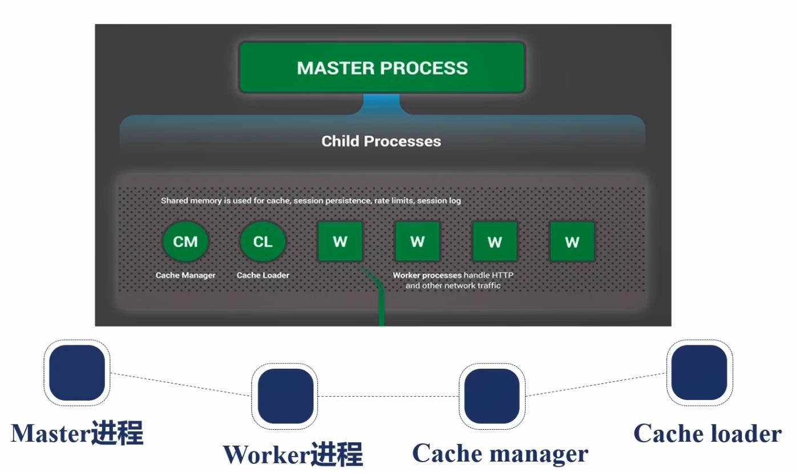

##nginx的请求处理流程

##nginx的进程结构

nginx使用多进程结构的原因：为了保证nginx的高可用性。线程之间内存共享，有可能互相影响，使用进程不会存在这种问题。

+ Cache Loader只负责缓存的加载
+ Cache Manager负责缓存的管理
+ worker进程和Cache Manager进程、Cache Loader进程通讯使用共享内存的方式
+ 在使用时，worker进程要和cpu核数一致，并且每个进程要与CPU核绑定，这样可以更好的使用CPU缓存，防止缓存失效

