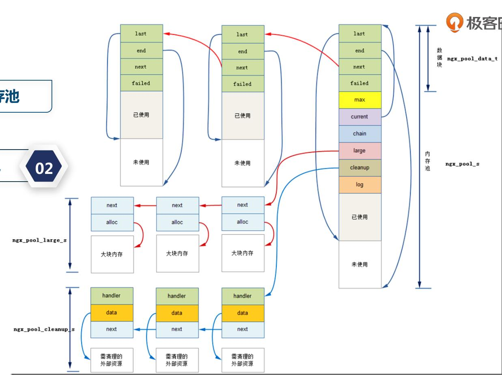

##nginx连接池
每一个nginx的worker进程都会对应一个ngx_cycle_t的结构体：

```
struct ngx_cycle_s {
    void                  ****conf_ctx;
    ngx_pool_t               *pool;

    ngx_log_t                *log;
    ngx_log_t                 new_log;

    ngx_uint_t                log_use_stderr;  /* unsigned  log_use_stderr:1; */

    ngx_connection_t        **files;
    ngx_connection_t         *free_connections;
    ngx_uint_t                free_connection_n;

    ngx_module_t            **modules;
    ngx_uint_t                modules_n;
    ngx_uint_t                modules_used;    /* unsigned  modules_used:1; */

    ngx_queue_t               reusable_connections_queue;
    ngx_uint_t                reusable_connections_n;

    ngx_array_t               listening;
    ngx_array_t               paths;

    ngx_array_t               config_dump;
    ngx_rbtree_t              config_dump_rbtree;
    ngx_rbtree_node_t         config_dump_sentinel;

    ngx_list_t                open_files;
    ngx_list_t                shared_memory;

    ngx_uint_t                connection_n;
    ngx_uint_t                files_n;

    ngx_connection_t         *connections;
    ngx_event_t              *read_events;
    ngx_event_t              *write_events;

    ngx_cycle_t              *old_cycle;

    ngx_str_t                 conf_file;
    ngx_str_t                 conf_param;
    ngx_str_t                 conf_prefix;
    ngx_str_t                 prefix;
    ngx_str_t                 lock_file;
    ngx_str_t                 hostname;
};
```

其中有三个数组：

    ngx_connection_t         *connections;
    
    ngx_event_t              *read_events;
    
    ngx_event_t              *write_events;
    
connections默认大小为512；一个请求占用两个链接；一个连接对应一个读事件和写事件。也就是read_events、write_events;

一个connections占用大约232字节、一个events占用大约96字节。

所以一个一个connect占用232+2*96字节。


## nginx连接内存池
```
struct ngx_connection_s {
    void               *data;
    ngx_event_t        *read;
    ngx_event_t        *write;

    ngx_socket_t        fd;

    ngx_recv_pt         recv;
    ngx_send_pt         send;
    ngx_recv_chain_pt   recv_chain;
    ngx_send_chain_pt   send_chain;

    ngx_listening_t    *listening;

    off_t               sent;

    ngx_log_t          *log;

    ngx_pool_t         *pool;

    int                 type;

    struct sockaddr    *sockaddr;
    socklen_t           socklen;
    ngx_str_t           addr_text;

    ngx_str_t           proxy_protocol_addr;
    in_port_t           proxy_protocol_port;

#if (NGX_SSL || NGX_COMPAT)
    ngx_ssl_connection_t  *ssl;
#endif

    ngx_udp_connection_t  *udp;

    struct sockaddr    *local_sockaddr;
    socklen_t           local_socklen;

    ngx_buf_t          *buffer;

    ngx_queue_t         queue;

    ngx_atomic_uint_t   number;

    ngx_uint_t          requests;

    unsigned            buffered:8;

    unsigned            log_error:3;     /* ngx_connection_log_error_e */

    unsigned            timedout:1;
    unsigned            error:1;
    unsigned            destroyed:1;

    unsigned            idle:1;
    unsigned            reusable:1;
    unsigned            close:1;
    unsigned            shared:1;

    unsigned            sendfile:1;
    unsigned            sndlowat:1;
    unsigned            tcp_nodelay:2;   /* ngx_connection_tcp_nodelay_e */
    unsigned            tcp_nopush:2;    /* ngx_connection_tcp_nopush_e */

    unsigned            need_last_buf:1;

#if (NGX_HAVE_AIO_SENDFILE || NGX_COMPAT)
    unsigned            busy_count:2;
#endif

#if (NGX_THREADS || NGX_COMPAT)
    ngx_thread_task_t  *sendfile_task;
#endif
};
```
    
```
struct ngx_pool_s {
    ngx_pool_data_t       d;
    size_t                max;
    ngx_pool_t           *current;
    ngx_chain_t          *chain;
    ngx_pool_large_t     *large;
    ngx_pool_cleanup_t   *cleanup;
    ngx_log_t            *log;
};
```

off_t               sent;变量bytes_sent

ngx_pool_t         *pool;内存池，可以通过connection_pool_size指定大小。

内存池数结构体：
```
typedef struct {
    u_char               *last;
    u_char               *end;
    ngx_pool_t           *next;
    ngx_uint_t            failed;
} ngx_pool_data_t;
```
内存池结构图:
